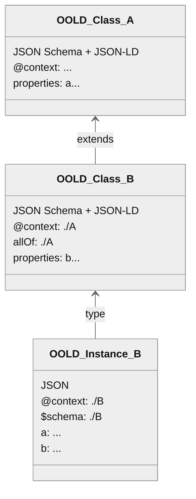

# Basic Concepts

The core idea is that an OO-LD document is always both a valid JSON Schema and a reference-able JSON-LD remote context as defined in [JSON-LD v1.1 section 3.1](https://www.w3.org/TR/2020/REC-json-ld11-20200716/#the-context) ( != JSON-LD document). In this way a complete OO-LD class / schema hierarchy is consume-able by JSON Schema-only and JSON-LD-only tools while OO-LD aware tools can provide extended features on top (e.g. UI autocomplete dropdowns for string-IRI fields based e.g. on a SPARQL backend, SHACL shape or JSON-LD frame generation).

A minimal example:

```json
--8<-- "examples/Thing.schema.json"
```

You can explore this in the [interactive playground](https://oo-ld.github.io/playground/).

## Schemas vs. instances

Note the asymmetry between how schemas and instances are consumed:

- An OO-LD **schema** is consumed as a JSON-LD remote **context** (referenced by its URL from an instance's `@context`), never as a JSON-LD document. **OO-LD schema documents MUST NOT be interpreted as JSON-LD documents**, because that would apply the schema's own `@context` to the schema itself and produce incorrect triples.
- An OO-LD **instance** *is* a valid JSON-LD document and is processed as such.

This asymmetry is what lets a single document serve both as a JSON Schema `$ref` target and as a JSON-LD remote `@context` for the same resource. Concretely: an instance is processed directly as a JSON-LD document (e.g. `jsonld.toRDF(instance)`), which loads the schema as a remote context via the instance's `@context`; a schema is only ever referenced as that context and MUST NOT itself be expanded as a document (`jsonld.toRDF(schema)` would wrongly apply the schema's own `@context` to it).

## Inheritance

The diagram below shows **inheritance**: Class B extends Class A by referencing it in both `allOf` (so JSON-Schema validators apply A's rules when validating B instances) and `@context` (so JSON-LD processors resolve A's term mappings). B instances are therefore valid A instances and carry all of A's properties alongside B's own additions.



You can read how this is implemented in OpenSemanticWorld/Lab in the [introduction](https://opensemantic.world/wiki/Item:OSWdb485a954a88465287b341d2897a84d6) and [schema documentation draft](https://opensemantic.world/wiki/Item:OSWab674d663a5b472f838d8e1eb43e6784).

Building types from *multiple* independent schemas (rather than a single parent) is covered in [Composition](composition.md).
