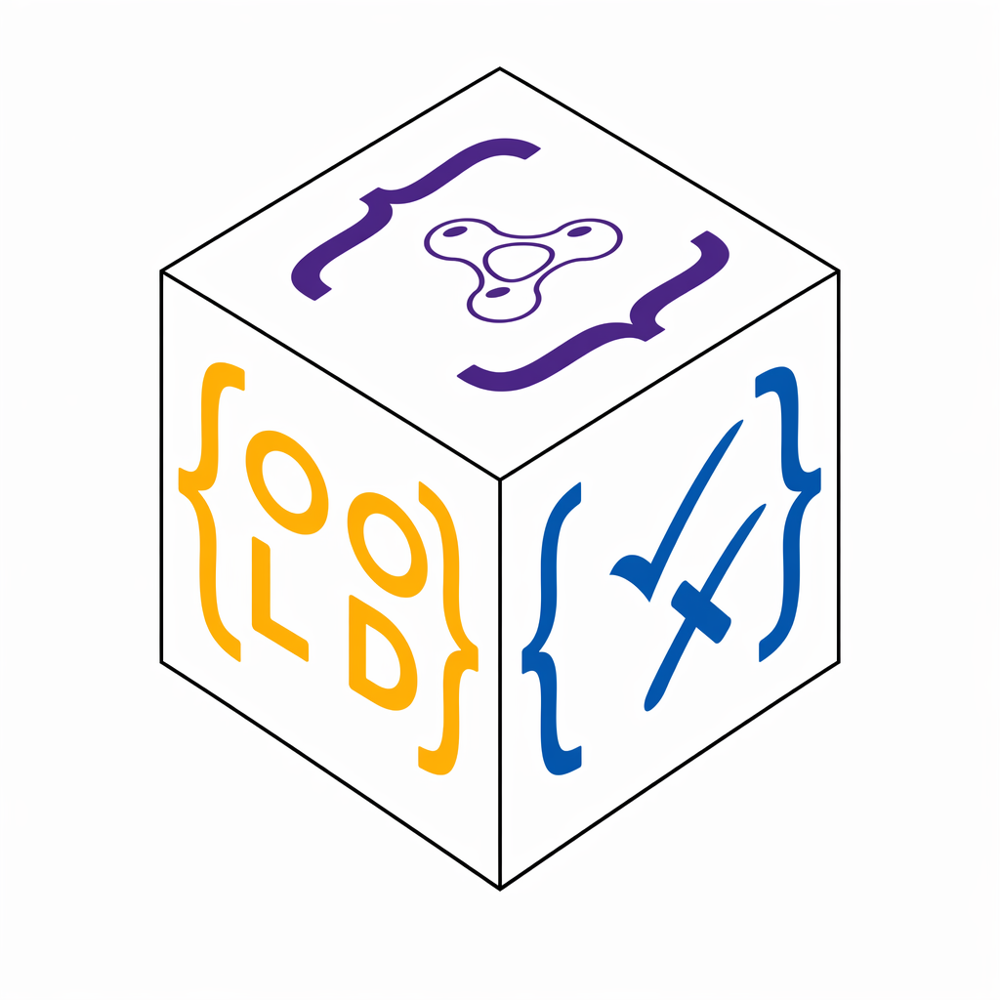

<h1 class="oold-hero__title">OO-LD Schema</h1>

Object-Oriented Linked Data - structure and semantics in a single document.

 An OO-LD document is at once a valid JSON Schema and a JSON-LD context. Define the structure of your data and its semantics in one source, then reuse that single schema for validation, RDF generation, code generation, user interfaces, and API definitions - using the standard JSON Schema and JSON-LD tooling you already have. 

 [Get started](get-started.md){ .md-button .md-button--primary } [Introduction](introduction.md){ .md-button } [Specification](spec/index.html){ .md-button } 

