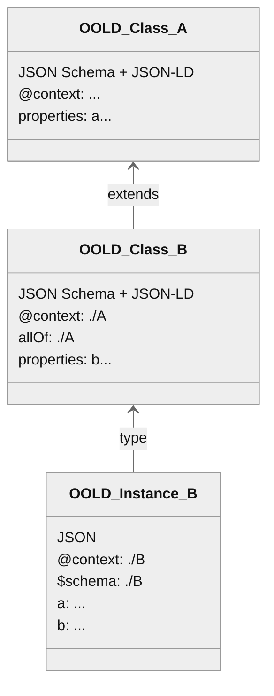

## Basic Concepts {#basic-concepts}

The core idea is that an [=OO-LD schema=] is always both a valid JSON Schema and a reference-able JSON-LD [=remote context=] as defined in [[JSON-LD11]] §3.1 (*not* a JSON-LD document). In this way a complete OO-LD class / schema hierarchy is consume-able by JSON Schema-only and JSON-LD-only tools while OO-LD-aware tools can provide extended features on top (e.g. UI autocomplete dropdowns for string-IRI fields based on a SPARQL backend, or SHACL shape / JSON-LD frame generation).

:::example{title="A minimal OO-LD schema"}
{{ example('Minimal') }}
:::

There is an asymmetry between how schemas and instances are consumed:

- An [=OO-LD schema=] is consumed as a JSON-LD [=remote context=] (referenced by its URL from an instance's `@context`), never as a JSON-LD document. :rule[OOLD-SCH-a9ee]{applies=implementation level="MUST NOT" summary="An OO-LD schema document must not be interpreted as a JSON-LD document."}OO-LD schema documents MUST NOT be interpreted as JSON-LD documents, because that would apply the schema's own `@context` to the schema itself and produce incorrect triples.
- An [=OO-LD instance=] *is* a valid JSON-LD document and is processed as such.

Because a schema is always reference-able as a [=remote context=], the context half is not optional. :rule[OOLD-SCH-96a3]{applies=document level=MUST summary="An OO-LD schema document must carry a root @context."}An [=OO-LD schema=] document MUST carry an `@context` at its root. Without one it is not reference-able: [[JSONLD11-API]] Context Processing aborts with `invalid remote context` when a referenced document has no top-level `@context` entry, so a context-less schema would pass schema validation and then fail inside a consumer's JSON-LD processor instead. The obligation is document-level; a nested subschema under `properties` or `$defs` carries no `@context` of its own, exactly as it carries no `$id`. The requirement is presence, not content: an empty context object satisfies it, as does one whose only entry is a reference to a remote context. A schema MAY leave every term unmapped and add semantics incrementally, as above; what it cannot do is omit the entry, because that is the one thing that makes the document unusable as a [=remote context=].

This asymmetry is what lets a single document serve both as a JSON Schema `$ref` target and as a JSON-LD remote `@context` for the same resource. Concretely: an instance is processed directly as a JSON-LD document (e.g. `jsonld.toRDF(instance)`), which loads the schema as a remote context via the instance's `@context`; a schema is only ever referenced as that context and, as required above, is not itself expanded as a document.

A term of an OO-LD schema MAY be left unmapped. An unmapped term is structurally valid and simply produces no triples under JSON-LD expansion, which is what lets semantics be added incrementally, one term at a time, rather than committed to up front. Where every term is intended to reach RDF, a schema MAY declare `@vocab` in its `@context`, mapping each otherwise-unmapped term into a default namespace, or carry the mapping in [`x-oold-context`](#synonyms), whose entries are promoted into the `@context` before a JSON-LD processor runs. :rule[OOLD-SCH-2d05]{applies=implementation level="MUST NOT" summary="An unmapped term is not a conformance failure, though a tool may report it under an opt-in strict mode."}An implementation MUST NOT treat an unmapped term as a conformance failure, though it MAY report one as guidance, or reject it under a strict mode the user opts into.

Leaving a term unmapped is a deferral, not a destination. :rule[OOLD-SCH-21d7]{applies=document level=SHOULD summary="A schema should offer at least one complete mapping, so its instances can round-trip through RDF without loss."}A schema SHOULD offer at least one **complete** mapping - a [target profile](#synonyms) under which every declared property carries a term - because a property with no term produces no triple, so an instance can only round-trip through RDF without loss under a mapping that covers all of them. A schema MAY carry further, deliberately partial profiles alongside it.

:::note{title="Inheritance"}
A class *B* extends a class *A* by referencing it in both `allOf` (so JSON Schema validators apply *A*'s rules when validating *B* instances) and `@context` (so JSON-LD processors resolve *A*'s term mappings). *B* instances are therefore valid *A* instances and carry all of *A*'s properties alongside *B*'s own additions. Building types from *multiple* independent schemas is covered in .
:::

:::example{title="Inheritance and instantiation"}

:::
